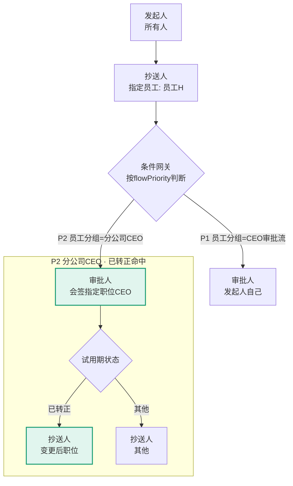
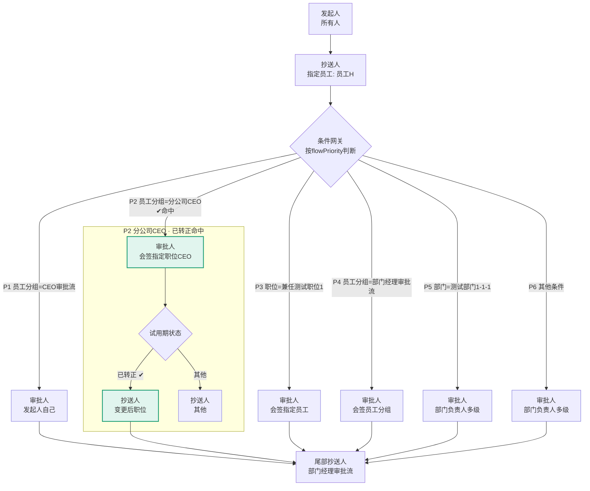

# 审批流程-可视化生成（★2026-08-12 方案定案：Mermaid）

> 当用户明确要求"画一下流程"或"流程图"时，AI **直接输出 Mermaid `flowchart` 代码块**，由宿主 Markdown 渲染器绘制。**★宿主已确认支持 Mermaid**。零脚本、零 SVG 计算、绝对稳定。**注意**：skill 主定位是"思考引导"，默认输出文字结构分析；流程图是**可选增强**，仅在用户明确要求时生成。

## ★★ 核心原则（2026-08-12 定案）

**放弃 JS/SVG 客户端渲染**（脆弱、复杂流程易错、内容缺失）。改用 **Mermaid**：

1. **AI 读 processSettingVo + 员工属性 + match[]** → 直接生成 Mermaid flowchart 代码块
2. **宿主 Markdown 渲染器**负责画图（原生支持，零依赖）
3. **命中/未命中用样式类高亮**（Mermaid `classDef`）
4. **嵌套用 `subgraph`**（表达并行网关/嵌套条件）

## Mermaid 语法速查



## 员工→适配流程的 Mermaid 输出规范

**输入**：`auth/v1/group/approval`（员工分组）+ #2 员工详情（部门/职位/汇报链）+ `approval/setting/{id}`（流程定义）+ match[]

**输出**（补卡员工D 完整示例）：



## 命中/未命中表达

| 状态 | Mermaid 实现 |
|------|-------------|
| **命中分支** | `classDef hit fill:#E1F5EE,stroke:#1D9E75` + 箭头标签 `✔命中` |
| **未命中分支** | `classDef miss fill:#EEEDFE,stroke:#7F77DD`（淡紫，仍彩色） |
| **兜底分支** | `classDef fallback fill:#FAEEDA,stroke:#EF9F27` |
| **嵌套并行** | `subgraph` 包裹 + 并行网关 `{菱形}` |

## 何时使用

| 用户问 | 输出 |
|--------|------|
| "画流程图"、"可视化"、"流程长什么样" | Mermaid 代码块 |
| 只要"分析流程"（问流程本身的结构/配置） | 文字结构 |
| 要"流程+图" | 文字骨架 + Mermaid 图 |
| **★"某员工 XX 审批是怎么走的 / 谁审批 / 走哪条分支"** | **完整 Mermaid 流程图 + 命中分支高亮 + 条件匹配分析表（见下）** |

## ★ 具体员工走向分析（最高频场景，2026-08-12 补，必须配图）

**当用户问"某员工的 XX 审批是怎么走的 / 他走哪条分支 / 谁会审批"时，禁止只给文字结论**——必须按以下四要素输出：

1. **完整 Mermaid 流程图**（所有分支全画）——命中分支 `classDef hit` 绿色高亮（+箭头 `✔命中`），未命中 `classDef miss` 淡紫淡化（仍可见），嵌套用 `subgraph`
2. **员工属性摘要**：姓名/部门/职位/员工分组/员工类型/试用期状态（来自 #2 详情 + auth/v1/group/approval）
3. **条件匹配分析表**：逐条列出 P1~Pn 的 命中条件 / 匹配结果（✔命中/✗未命中/兜底）/ 命中原因（依据员工属性哪条命中）
4. **命中路径文字总结**：一句话串联"发起 → 命中 Pn → 审批链 → 尾部"（人话版）

> **判据**：问题主语是"具体员工 + 审批类型"（如"员工K的补卡怎么走"）→ 命中此场景，配图；问题主语是"流程配置本身"（如"补卡流程都有哪些分支"）→ 文字结构即可。

## 数据获取链路（前置）

```
findApprovalGroupVo                       ← 拿 approvalSettingId（★每次现查，因环境而异勿硬编码）
  → approval/setting/{approvalSettingId}  ← ★首选：已发布流程定义（无草稿锁）
  → auth/v1/group/approval                ← 员工分组（员工→适配流程）
  → #2 员工详情                           ← 部门/职位/汇报链
```
> **★鉴权**：正式版接口 `approval/setting/{id}` 直接返回已发布版本（2026-08-11 实测，201KB）；draft 是草稿可能被锁。二方接口需宿主 IHR360_API_TOKEN。

## 相关文档

- 流程定义接口：`api-handbook/08-审批相关/审批类型设置-流程定义.md`
- 员工分组：`api-handbook/08-审批相关/审批流权限分组-员工部门范围.md`
- 节点枚举：同上（nodeType/signType/approverType，含 HandleTask 办理人）
- 补卡流程结构示例：上文「员工→适配流程」+ 流程定义文档「补卡流程定义（最复杂）」节（6 条件分支 + 嵌套并行 + HandleTask 办理人）。**不附完整 JSON 样例**——流程定义含真实员工 ID/公司 ID，仅文档文字描述结构（2026-08-12 定案）
